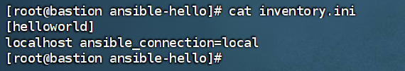
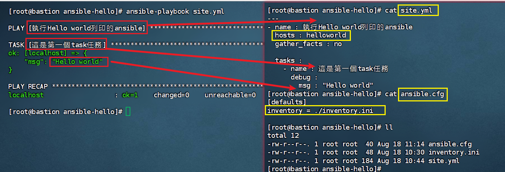
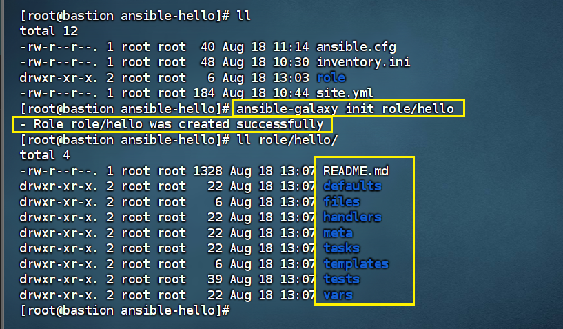
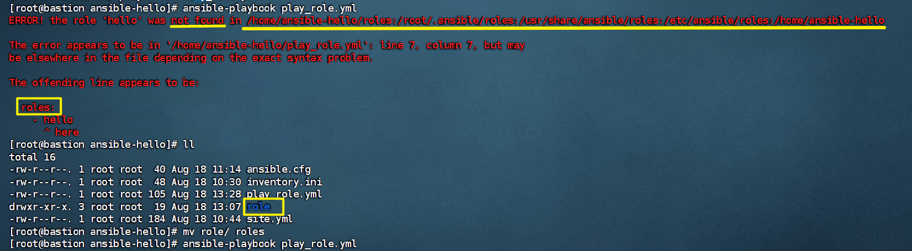

# Ansible 學習筆記

## 什麼是 Ansible

Ansible 是一個基於 Python 的自動化工具，用來管理伺服器配置、部署應用程式及自動化 IT 任務。它採用 **無代理（agentless）架構**，透過 **SSH 連線** 管理目標主機，使用簡單易讀的 YAML 語法撰寫 Playbook。

## 📌 什麼是冪等性 (Idempotency)

在 自動化配置管理 裡，**冪等性指的是 同一個操作不管執行多少次，最終結果都會是一樣的**。

換句話說：

第一次執行：**會做出需要的改變**（例如安裝套件、修改檔案）。

第二次、第三次再執行：如果系統已經符合需求，就不會**再重複改變**。 

舉例：
```yaml
- name: 安裝 httpd
  yum:
    name: httpd
    state: present
```  
  
如果系統 **還沒裝 httpd → Ansible 幫你安裝。**

如果系統 **已經有 httpd → 不會重複安裝。**

這就是**冪等性，避免「無謂的動作」**。

### 名詞與生活比喻

| 名詞 | 生活比喻 |
|------|-----------|
| Task | 做一件事 → 比如煮一杯咖啡 |
| Play | 一組人做一組任務 → 比如「媽媽煮咖啡、弟弟拿餅乾」 |
| Playbook | 整本活動手冊 → 「早晨聚會流程，從煮咖啡到擺桌子」 |
| Variable | 可替換的資訊 → 「咖啡口味」可以變化 |
| Role | 模組化單元 → 「煮咖啡的流程」可以重複用在不同場合 |

---

## Inventory 與 Playbook 關係

- **Inventory**：主機清單

```ini
[helloworld] # 群組名稱
localhost ansible_connection=local # 主機名稱 + 連線方式
```



- **Playbook**：告訴 Ansible"要對哪些主機做什麼事"

```yaml
- name: 執行Hello world列印的ansible  # Play 名稱
  hosts: helloworld            # 操作的主機群組
  gather_facts: no             # 不收集系統資訊

  tasks:
    - name: 這是第一個task任務  # Task 名稱
      debug:
        msg: "Hello world"          # Module debug 顯示訊息
```

> 注意：
> - Playbook 名稱可自訂，但執行時要指定正確路徑
> - 如果 `hosts:` 指向不存在的群組，會出現 `skipping: no hosts matched`

---

## 如何使用 Ansible

1. **建立 Ansible 配置檔案** `ansible.cfg`（這是為了可以直接使用 `ansible-playbook {playbook}`）

```ini
[defaults]
inventory = ./inventory.ini
```

2. **建立 Inventory 清單** `inventory.ini`

```ini
[helloworld]
localhost ansible_connection=local
```

3. **執行 Playbook**

```bash
# 指定 Inventory
ansible-playbook -i inventory.ini playbook.yml

# 使用 ansible.cfg 的預設 inventory
ansible-playbook playbook.yml
```

---

## 建立 Role
# Ansible Role 介紹


在 Ansible 裡，**Role** 是一個「模組化、可重複使用的任務單元」，它把相關的任務、變數、模板、靜態檔案、Handler 等都整理在一起，方便你在不同 Playbook 或專案中重複使用，而不需要每次都重寫整個流程。


簡單說，**Role 就像一個小型程式庫或功能模組**。
```bash
ansible-galaxy init roles/檔名
```


生成的 Role 結構如下：

```
roles/
└── 檔名/
├── README.md # Role 說明文件
├── defaults/
│ └── main.yml # 預設變數（低優先級）
├── files/ # 靜態檔案，例如設定檔、安裝包
├── handlers/
│ └── main.yml # 通知 Handler，例如重啟服務
├── meta/
│ └── main.yml # Role 元資料，例如依賴其他 Role
├── tasks/
│ └── main.yml # 主要任務流程
├── templates/ # Jinja2 模板檔案
└── vars/
└── main.yml # 高優先級變數
```
# Ansible 實務錯誤：目錄命名錯誤

## 錯誤現象

執行 `ansible-playbook` 時出現以下錯誤：
```bash
ERROR! the role 'hello' was not found in /path/to/roles/...
```
[](image/ansible/roles目錄.png)

