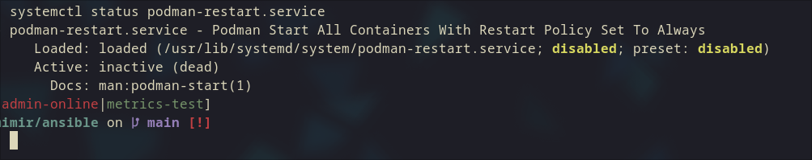

# Linux 容器與虛擬化相關技術筆記

## 一、Linux 使用 Namespace 隔離與 cgroups 限制做資源管理

### Namespace（命名空間）
- 提供資源的「視角**隔離**」，讓每個容器或程序有獨立的資源觀察範圍，如獨立的進程號（PID）、網路介面（NET）、掛載點（MNT）等，互相隔離看不到對方。

### cgroups（控制群組）
- 用於**限制**和管理系統資源（CPU、記憶體、磁碟 I/O 等）使用量，確保容器或程序不會占用超過配置的資源，避免單一容器資源暴走影響整體系統。

## 二、VM（虛擬機）與容器差異

| 項目       | VM (虛擬機)                              | 容器                                    |
|------------|----------------------------------------|-----------------------------------------|
| 核心概念   | **模擬完整硬體環境**，包含 CPU、記憶體等   | **共用宿主機 OS 核心**，只隔離使用者空間與資源 |
| 系統組成   | 完整客戶作業系統（含 Kernel）          | 只有使用者空間，Kernel 與宿主共用         |
| 安全性     | **高**，因獨立 Kernel                      | 較**低**，Kernel 漏洞可能導致容器逃逸         |
| 資源消耗   | 大                                     | 輕量，快速啟動                          |
| **root 權限影響** | 容器 **內 root 影響限於 VM**              | 容器內 **root 權限可能直接危害宿主機安全**   |

## 三、Docker 與 Podman 差異

| 項目       | Docker                          | Podman                        |
|------------|--------------------------------|------------------------------|
| 架構       | 有常駐守護進程（dockerd）       | 無守護進程，daemonless       |
| 容器管理   | 透過 dockerd 管理容器           | 每個容器獨立運行              |
| 預設權限   | 預設以 root 身份執行            | 支援 rootless 模式            |
| 重啟機制   | 支援 --restart 自動重啟         | 有預設守護進程可以開啟podman-restart.service ，也可以另外搭配 systemd restart  |
| 安全性     | root 權限較高                  | rootless 減少攻擊面，較安全  |

## 四、Docker 與 Podman 容器重啟差異

- **Docker**：守護進程 dockerd 支援 `--restart` 參數，daemon 重啟或宿主機重啟會自動重啟容器。
- **Podman**：可以開啟podman-restart.service 。或是可用 `podman generate systemd` 生成 systemd 服務單元，交由 systemd 管理。

## 五、Kubernetes（K8s）中 Root 權限與 User Namespace 隔離

- 預設容器以 root 身份運行，風險較高。
- K8s 1.33 起，預設啟用 User Namespace 隔離（`hostUsers: false`），將容器 root UID 映射成宿主機非 root 用戶，降低風險。
- 需 Linux Kernel ≥6.3，容器 runtime 與檔案系統支援。

Reference:  
[Securing Kubernetes 1.33 Pods: The Impact of User Namespace Isolation](https://www.cncf.io/blog/2025/07/16/securing-kubernetes-1-33-pods-the-impact-of-user-namespace-isolation/)

---

## 總結

| 主題                     | 核心重點                                         |
|--------------------------|------------------------------------------------|
| Namespace + cgroups       | Namespace 隔離資源視角，cgroups 限制資源量         |
| VM vs 容器               | VM 獨立 kernel 高安全但重資源，容器輕量但風險高     |
| Docker vs Podman          | Docker 有守護進程，Podman 無守護進程且支援 rootless |
| 容器重啟                 | Docker 支援自動重啟，Podman 要開啟podman-restart.service或systemd 管理          |
| K8s rootless             | 1.33 版起預設 User Namespace 隔離降低 root 風險      |
| Podman 與 systemd / Quadlet | systemd 管理生命週期，Quadlet 用 YAML 簡化配置      |

