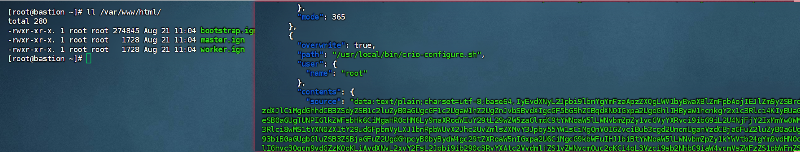

# RHCOS 與 RHEL 差異整理

## 1. 定位與用途
- **RHEL (Red Hat Enterprise Linux)**: 通用型作業系統，適用於各種伺服器與應用。
- **RHCOS (Red Hat CoreOS)**: 為 OpenShift/Kubernetes 設計的專用 OS，只能作為 Node 使用。

## 2. 套件與管理方式
- **RHEL**: 提供 yum/dnf，可自由安裝與修改。
- **RHCOS**: 不提供完整套件管理，透過 MachineConfig Operator (MCO) 與 rpm-ostree 更新。

## 3. 維護與更新
- **RHEL**: 傳統 patch/update 模型，需管理員決定。
- **RHCOS**: 原子性更新，由 OpenShift Operator 自動控制。

## 4. 使用情境
- **RHEL**: 資料庫、應用伺服器、虛擬化、一般伺服器。
- **RHCOS**: 專用於 OpenShift Master/Worker 節點。

## 5. 安全與一致性
- **RHEL**: 高度可自訂，安全性依賴管理員維護。
- **RHCOS**: 不可變設計，節點一致性高，由 Operator 控制。

---

## 總結表格

| 特性          | **RHEL** | **RHCOS** |
|---------------|----------|-----------|
| 定位          | 通用型 OS | Kubernetes/OpenShift 專用 OS |
| 套件管理      | yum/dnf 可自由安裝 | 不可手動安裝，透過 MCO 管理 |
| 系統彈性      | 高，自由修改 | 低，幾乎唯讀 |
| 更新方式      | 傳統 patch/update | 原子性 ostree 更新 |
| 適用場景      | DB、應用伺服器、VM、一般伺服器 | OpenShift Master/Worker 節點 |
| 管理方式      | 系統管理員 | OpenShift Operator 自動化 |
---

---
# 1. Ignition 是什麼？
- **Ignition** 是專為 **Immutable Linux 系統（如 CoreOS 家族）** 設計的 **開機初始化工具**。  
- 它在 **第一次開機（first boot）** 時讀取 `.ign` 配置檔，完成以下操作：
  - 磁碟分割與格式化  
  - 檔案寫入（例如 ssh key、配置檔）  
  - 使用者建立  
  - systemd 服務設定  
- **特點**：
  - 僅作用於 **第一次開機**，之後不會再執行  
  - 保證系統從一開始就達到 **一致的狀態**  
  - 適合自動化、無人值守部署大規模叢集  

**簡單理解**：專注於 **底層初始化與不可變系統設定**，而非套件安裝或日後修改。

---

## 2. 為什麼 RHCOS 可以用 Ignition，但 RHEL 不能？
- **RHCOS / FCOS (Fedora)**：
  - **Immutable OS**：系統不可變，核心與套件由映像管理，初始狀態必須在第一次開機就寫好  
  - **原生支援 Ignition**：開機前讀取 `.ign`，完成磁碟、使用者、network、systemd 設定  
- **RHEL / Rocky Linux / RHCL**：
  - **Mutable OS**：系統可自由修改，套件和設定可隨時變更  
  - **不支援 Ignition**：使用 **Kickstart** 或 **cloud-init** 進行自動化安裝  
  - 核心差異：RHEL 的操作層與文件系統架構不兼容 `.ign` JSON 配置  

**結論**：RHCOS/FCOS 設計就是為了 **初始開機即設定完整狀態**，因此支持 Ignition；RHEL 是傳統可變系統，初始安裝後再修改設定，無法使用 Ignition。

---

## 3. Immutable Linux 系列整理

### 3.1 RHCOS（Red Hat CoreOS）
- **用途**: 專為 OpenShift Kubernetes 平台設計  
- **特性**:
  - Immutable OS  
  - 自動化更新（OSTree 映像）  
  - 內建容器化，預設支援 Kubernetes  
  - Ignition 支援（bootstrap、networking、使用者、ssh key）  
  - 無人值守安裝  

### 3.2 Fedora CoreOS (FCOS)
- **開發者**: Red Hat 社群版（RHCOS 上游）  
- **特點**:
  - Immutable OS  
  - 自動更新，可滾動或暫停  
  - 內建 Podman、container tools  
  - 使用 Ignition 作初始化設定  
- **用途**:
  - Kubernetes 節點  
  - 自建 K8s 或 OpenShift 社群版  

### 3.3 Ubuntu Core
- **開發者**: Canonical  
- **特點**:
  - Snaps 管理應用與系統  
  - Immutable 系統核心  
  - 強調 IoT 與邊緣運算  
- **用途**:
  - IoT 裝置  
  - Kubernetes 節點（需 MicroK8s 或 kubeadm）  

### 3.4 Fedora Silverblue
- **性質**: Immutable Desktop Linux  
- **開發者**: Fedora Project 社群（Red Hat 支持）  
- **核心概念**:
  - 不可變系統，核心與套件固定  
  - 原子更新，可回滾  
  - 鼓勵容器化應用（Flatpak）  
- **定位**:
  - Silverblue = Immutable Desktop  
  - Fedora CoreOS = Immutable Server / K8s 節點  
  - RHCOS = 企業級 CoreOS，專為 OpenShift  